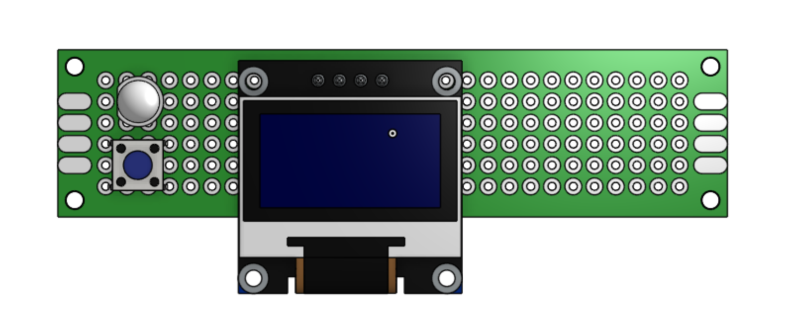
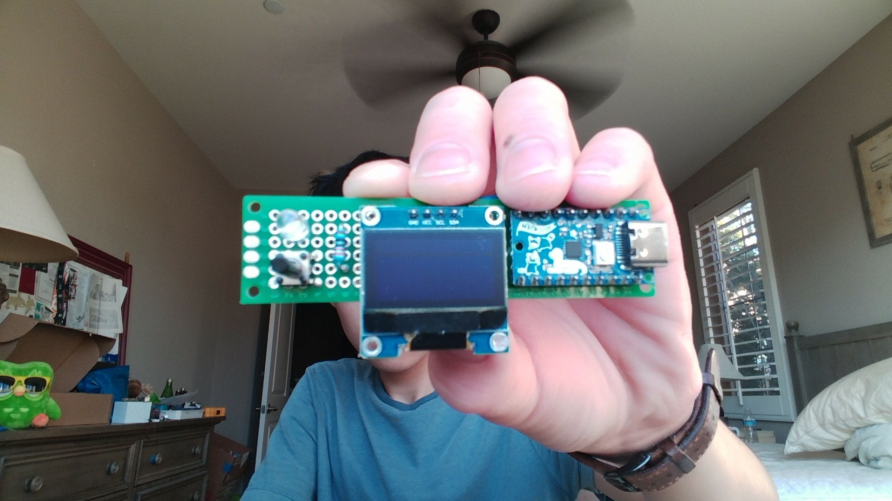
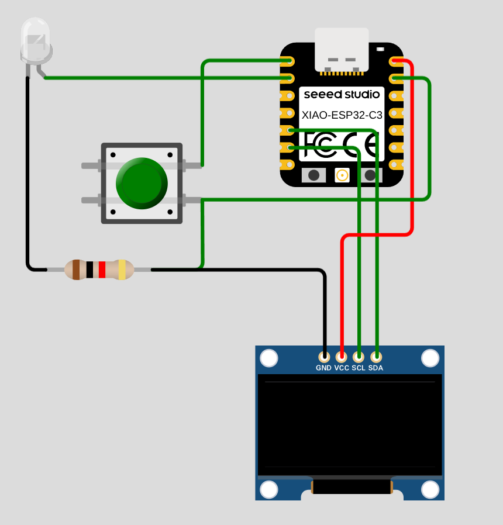

# Morse-Code-Keyboard
A keyboard that types with one button, using morse code!

I started this project to make the most useless keyboard in existence >:) It uses Hack Club's very own CH32X035 devboard, a push button, an LED, and a 128x64 OLED to type letters into your computer using Morse Code. When it's not in typing mode, it acts as a Morse Code trainer!

The Morse Code Keyboard is assembled on a 20x80mm perfboard. The CH32X035 devboard reads the input from the button (long and short presses) and turns that into letters in Morse Code. The on-board LED lights up when the button is pressed to confirm the inputs. The 128x64 OLED displays the inputs (dots and dashes) the CH32X035 believes to have read and the translated letters. I may update to a 0.91" OLED in the future to make the design slimmer. 

Unfortunately, I haven't yet coded it due to the software guard of the CH32X035. Thus, I'm submitting this project for funding for the WCH-LinkE!

# Assebmly

To assemble the Morse Code Keyboard, you'll need:

- 1x 20x80mm Perfboard
- 1x CH32X035 Devboard
- 1x 128x64 OLED
- 1x 220ohm Resistor
- 1x 5mm LED
- 1x 6x6mm Push Button

Wire the components:

Button: PB12
LED: PA3 (Through 220ohm Resistor)
OLED SDA: PA0
OLED SCL: PA1
OLED VCC: 3V3

GND's go to GND, etc.

Here's a Wokwi wiring diagram (around the XIAO ESP32) for refrence!

# Firmware

I haven't done this yet, not before funding :P

# Use

I haven't done this either

# AI Use

Organise wiring, find parts, debug code
